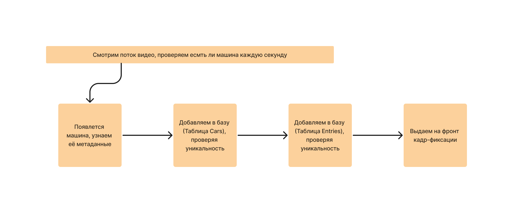
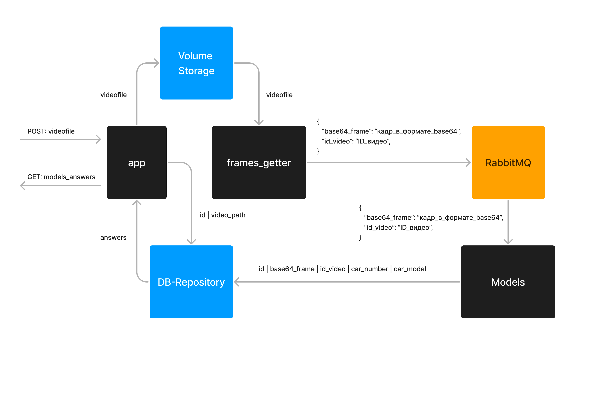

# ML System Design Doc
св 
### 1. Цели и предпосылки

### 1.1. Зачем идем в разработку продукта?

- Бизнес-цель - создание системы автоматической детекции и распознавания автомобилей и автомобильных номеров.
- Система автоматической детекции и распознавания автомобилей позволит ускорить и автоматизировать проверку автомобилей на КПП/ на стойках въезда и выезда на платных участках дороги и др.

**Автоматизация проверки автомобилей на въезде и выезде позволит:** 

- Исключить человеческий фактор и злоупотребления со стороны посетителей или персонала, повысить выручку; 

- Сделать все процессы прозрачными, получить статистику для принятия взвешенных управленческих решений; 

- Сократить эксплуатационные затраты; 

- Сделать парковку удобной, безопасной, современной. 

Успехом итерации с точки зрения бизнеса можно считать следующее:

- Повышение точности детекции автомобилей и распознавания номеров
- Сокращение издержек при привлечении человеческого труда
- Уменьшение времени обработки
- Улучшение интеграции с другими системами: разработка API или других решений для удобного взаимодействия проекта с партнерскими продуктами и сервисами

### 1.2. Бизнес-требования и ограничения

- Система автоматической детекции и распознавания автомобилей и автомобильных номеров будет использоваться для учета проезжающих автомобилей на автодорогах и улучшения процессов парковки. Детальные документы с бизнес-требованиями содержат информацию о требуемой точности распознавания номеров, скорости обработки данных, совместимости с другими системами и интеграции с существующими базами данных.
- Бизнес-ограничения включают в себя ограничения в обработке видеоданных с высокой скоростью, необходимость защиты персональных данных в соответствии с законодательством о конфиденциальности, а также требования к достаточной освещенности на КПП для корректной работы системы.
- От конкретной итерации ожидается разработка и оптимизация алгоритмов детекции и распознавания автомобилей и номеров на видеопотоке. Также требуется создание системы хранения и обработки полученных данных, а также разработка пользовательского интерфейса для удобного взаимодействия с системой.
- В рамках пилотного проекта система будет установлена на парковке, где будет производиться автоматическая детекция и распознавание автомобильных номеров. Результаты распознавания будут передаваться в базу данных для дальнейшего анализа и использования в существующих бизнес-процессах. Например, эти данные могут быть использованы для учета заезжающих/выезжающих автомобилей на парковке.
- Успешным пилотом будет считаться достижение высокой точности распознавания номеров, высокая скорость обработки данных и корректная интеграция с существующими системами. Критерии успеха также включают соблюдение законодательных требований по защите персональных данных и соблюдение стандартов безопасности. В случае успеха пилотного проекта, возможным путем развития проекта станет масштабирование системы на более крупные территории или внедрение дополнительных функций, например, автоматического распознавания цвета автомобиля.

### 1.3. Что входит в скоуп проекта/итерации, что не входит

- Что будет закрыто:
- На этапе подготовки пилота можем подготовить следующие модели:
- Модель по детекции автомобиля
- Модель по детекции автомобильного номера
- Модель по распознаванию автомобильного номера
- Модель по распознаванию автомобиля

Также при подготовке пилота будет подготовлен тестовая страница для загрузки видео и подготовлен сервис по нарезке видео на кадры и отправки кадров в модели, а также БД для хранения результатов

- Что не будет
закрыто: хранение фото в базе, работа с потоковым видео (например, по протоколу RSTP), UI

### 1.4. Предпосылки решения

- Запрос бизнеса: Создание эффективной системы для автоматического распознавания автомобилей и их номеров на основе компьютерного зрения и методов машинного обучения поможет оптимизировать ряд процессов, таких как контроль трафика, страхование, ИТ-инфраструктура для автострад, управление муниципальными службами (например, эвакуация) и операций с представителями государственных органов. Также использование данной системы может снижать стоимость обслуживания при помощи сокращения затрат на человеческий труд для распознавания автомобилей и их номеров.
- Горизонт прогноза: В контексте данного проекта горизонт прогноза не является основополагающим моментом, так как задача состоит в распознавании автомобилей и их номеров в фиксированный момент времени, а не в предсказании будущей информации. Однако система может быть использована для анализа прошедших событий или в режиме реального времени.
- Гранулярность модели: Модель должна иметь достаточное хорошее качество, чтобы обрабатывать изображения с различными уровнями детализации, как, например, хорошо видимые автомобили и их номера на переднем плане или частично запредельные объекты на заднем плане. Главное требование - возможность корректно определить автомобиль и его номер независимо от вариаций освещения, расстояния, ракурса и качества исходного изображения или видео.
- При разработке системы детекции автомобилей и их номеров важно обеспечить ее адаптивность к изменениям внешних условий, точность распознавания и эффективность работы на реальных данных. Это позволит успешно внедрить сформированное решение в рабочие процессы и удовлетворить потребности бизнеса.

### 2. Методология

### 2.1. Постановка задачи

• Что делаем с технической точки зрения: система верификации автомобиля (computer vision). Для реализации системы верификации автомобилей потребуется сделать следующее:
****

- Модель детекции автомобиля
- Модель детекции автомобильного номера
- Модель распознавания символов на автомобильном номере
- Модель распознования марки и модели автомобиля
- Возможность загрузить видео и получить ответ с результатом
- Модуль нарезки на кадры

### 2.2. Этапы решения задачи

**Этап 1 - подготовка данных**

Требования к данным:
Фотографии автомобилей и номерных знаков с разных ракурсов и при разных условиях освещения. Качество фото должно быть такого уровня, чтобы визуально можно было разглядеть автомобили и номерные знаки.

Для сбора данных и формирования датасета могут быть использованы следующие источники:

| Название датасета | Ссылка на датасет | Краткое описание | Для какой задачи требуется? | Требуется ли переразметка? |
| --- | --- | --- | --- | --- |
| UA-DETRAC: Detection and Tracking of Vehicles Dataset | https://detrac-db.rit.albany.edu/ | UA-DETRAC содержит 10 часов видеозаписей с 140 тысячами кадров, снятых 4 видеокамерами с около 8200 автомобилей и их ограничительными рамками. | Детекция автомобиля и его распознавание | + |
| The Comprehensive Cars (CompCars) Dataset | https://mmlab.ie.cuhk.edu.hk/datasets/comp_cars/ | СompCars содержит данных of 136,726 изображений, аннотаций 1716 автомобилей, состоящих из 171 зарегистрированных производителей автомобилей и 2004 различных моделей и марок автомобилей. | Детекция автомобиля и его распознавание | + |
| VMMR dataset | https://github.com/faezetta/VMMRdb/tree/master | The Vehicle Make and Model Recognition dataset (VMMRdb) is large in scale and diversity, containing 9,170 classes consisting of 291,752 images, covering models manufactured between 1950 and 2016. VMMRdb dataset contains images that were taken by different users, different imaging devices, and multiple view angles, ensuring a wide range of variations to account for various scenarios that could be encountered in a real-life scenario. The cars are not well aligned, and some images contain irrelevant background. The data covers vehicles from 712 areas covering all 412 sub-domains corresponding to US metro areas. Our dataset can be used as a baseline for training a robust model in several real-life scenarios for traffic surveillance. | Детекция автомобиля и его распознавание | + |
| Nomeroff Russian license plates | https://www.kaggle.com/datasets/evgrafovmaxim/nomeroff-russian-license-plates |  | Детекция и распознавание автомобильных номеров | +- Требуется проверка данных |

**Этап 2 - разработка пайплайна загрузки и аугментации изображений**

- Работа с датасетом: формирование датасета, его разметка, аугментация, добавление и удаление примеров.
1. Для бейзлайна - сбор данных для обучения и тестирования модели детекции автомобилей и автомобильных номеров.
2. Для Бейзлайна - сбор большего количества данных для обучения модели распознавания автомобильных номеров и марки автомобиля

**Этап 3 - обучение и сравнение моделей детекции и распознавания**

Выбор подходящей модели детекции объектов. Загрузить предварительно обученную модель настройки её параметров. Переобучить модель на подготовленном датасете, чтобы она могла распознавать автомобили и их местоположение на изображении.

Если качество моделей детекции автомобиля и автомобильных номеров выше 70% переходим к шагу создания MVP.

1. Бейзлайн - обучение моделей детекции автомобиля и автомобильных номеров
2. MVP - обучение моделей распознавание автомобиля и автомобильных номеров

**Метрики моделей детекции и распознавания**

| Model | mAP 0.5 | mAP 0.5_0.95 | Precision | Recall |
| --- | --- | --- | --- | --- |
| FasterRCNN | 0.946 | 0.78 | 0.907 | 0.989 |
| YOLOv5 | 0.986 | 0.815 | 0.967 | 0.958 |

| Model | Best_accuracy | Best_norm_ED |
| --- | --- | --- |
| EasyOCR | 95.927 | 0.9905 |

**Этап 4 - подготовка инференса модели**

1. Бейзлайн - подготовка ноутбука для проверки работы моделей деткции автомобиля и автомобильных номеров
2. MVP -  подготовка сервиса, куда пользователь может загрузить видео, далее видео будет нарезано на кадры, и кадры будут отправлены в модели детекции и распознавания автомобилей и автомобильных номеров.

**Этап 5 - тестирование и отладка**

1.  Бейзлайн - Провести тестирование модели на отложенной выборке.
Осуществить поиск нужных гиперпараметров. Провести анализ ошибок.
2. MVP - отладка всего процесса пайплайна, исправление ошибок в работе сервиса. 

**Этап 6 - Вывод результатов**

- Формирование отчета о проделанной работе, достигнутых результатах и возможных улучшениях
- Представление результатов команде и заказчику
- Планирование дальнейших шагов по развитию системы верификации автомобилей и автомобильных номеров

Описание техники:

- Формирование датасета для обучения, тестирования и валидации:

MVP: Использование существующих датасетов с размеченными изображениями автомобилей и номерных знаков.

Baseline: Обогащение существующих датасетов собственной разметкой и аугментацией данных для обучения, тестирования и валидации.

- Горизонт, гранулярность, частота пересчета прогностических моделей:

Бейзлайн: Обучение модели на данных с разовым горизонтом, без будущего обновления.

MVP: Регулярное обучение модели с учетом изменений в типах и характеристиках автомобилей или актуализации номерных знаков.

- Выбор целевых переменных:

MVP: Целевая переменная - детекция автомобиля и номерного знака

Бейзлайн: распознавание автомобиля и номерного знака

- Используемые метрики качества:

MVP: mAP 0.5, mAP 0.5_0.95, Precision и Recall.

Baseline: Добавление метрики Accuracy score и Евклидово расстояние для распознавание. Если номер имеет хоть одну ошибку распознавания, то это будет считаться как другой номер.

- Необходимый результат этапа:

Бейзлайн: Необходимым результатом будет достижение
Recall >=0.7
Precision >= 0.7

MVP: Достижение более высокой точности и полноты.

- Риски и планы по их устранению:

Бейзлайн: Недостаточная точность, сложность данных, недостаточное количество размеченных данных.

MVP: Устранение выявленных недостатков на этапе MVP и расширение функционала.

- Бизнес-проверка результата:

Бейзлайн: Результаты модели будут проверены самими разработчиками

MVP: На этом этапе планируется внедрение системы на КПП парковки с возможности оценки качества работы системы пользователем.

### 3. Подготовка пилота

### 3.1. Способ оценки пилота

Пилот проекта оценивается следующий образом:

- Автоматические тесты (например, pytests). для проверки работы модуля системы
- Ручное тестирование для проверки всего пайплайна работы системы

### 3.2. Что считаем успешным пилотом

Успехом пилота будет считаться работающий сервис с возможностью загрузить видео с автомобилем и получением ответа об распознанном автомобиле и автомобильном номере.

### 3.3. Подготовка пилота

- На этапе подготовки пилота можем подготовить следующие модели:
- Модель по детекции автомобиля
- Модель по детекции автомобильного номера
- Модель по распознаванию автомобильного номера
- Модель по распознаванию автомобиля

Также при подготовке пилота будет подготовлен тестовую страницу для загрузки видео и подготовлен сервис по нарезке видео на кадры и отправки кадров в модели. 

### 4. Внедрение

### 4.1. Архитектура решения

**Сервисы (инструменты):**

- PostgreSQL (хранение метаданных)
- AWS S3 (хранение фото-видеофиксации)

**Микросервисы:**

- app - микросервис получения видео от пользователей
- frames_getter - микросервисы для нарезки видео на кадры и выбор “лучших для анализа” кадров
- Volume Storage - место для хранения порезанных кадров для отправки в модели
- RabbitMQ - брокер сообщений для передачи задач в модели и получения ответов
- Models - модели детекции и распознавания автомобилей и номеров, реализует всю логику пайплайна обработки
- DB-Repository - микросервис-репозиторий для обращения к БД

**Модели:**

- YOLO - определение есть ли машина на кадре и детекция автомобильных номеров
- EasyOCR - распознавание знаков на автомобильных номерах
- EfficientNet - определение марки, модели и поколения автомобиля
- Модель для сравнения косинусного расстояния с векторами из векторной базы

### 4.2. Описание инфраструктуры и масштабируемости

- В качестве сервера для тестирования MVP использовался компьютер с AMD Ryzen 7 5800X 8-Core процессором, видеокартой RTX 3090 Ti с 24 Gb видеопамяти и 32 Gb RAM.  Система может быть перенесена на менее производительные серверные мощности, минимальные требования - наличие видеокарты Nvidia RTX 3060 12 Gb видеопамяти и аналогичным по мощности процессору.

### 4.3. Требования к работе системы

 Система должна иметь следующие характеристики и соответствовать следующим требованиям:

- Точность распознавания автомобильных номеров: система должна обеспечивать высокую точность распознавания автомобильных номеров, чтобы минимизировать количество ложных срабатываний и не пропустить мимо целевые транспортные средства. Точность должна составлять не менее 70%.
- Скорость обработки изображений: система должна обрабатывать изображения с автомобилями и номерными знаками быстро, чтобы оперативно реагировать на различные ситуации. Время обработки одного видео не должно превышать 60 секунд.
- Работа в различных условиях освещения и погоды: система должна быть адаптирована для корректной работы в условиях плохой видимости, непогоды, ночного времени суток, различных типах освещения (естественное/искусственное).
- Масштабируемость: возможность интеграции системы с другими проектами и устройствами, благодаря которому систему можно будет развернуть на большом количестве камер и расширять ее функциональность.
- Безопасность и конфиденциальность: система должна обеспечивать безопасность хранения и передачи данных, особенно в случаях связи с системами автопарков, служб автоматического учета протоколов и т.п. К системе должны иметь доступ только авторизованные пользователи, и доступ к данным должен осуществляться только по необходимости.
- Гибкость алгоритмов: возможность обучения и доработки алгоритмов детекции автомобилей и распознавания номеров, чтобы система была способна адаптироваться к меняющимся условиям и обеспечивать актуальность результатов

### 4.4. Безопасность системы

- Несанкционированный доступ: Несанкционированный доступ к системе детекции автомобилей и автомобильных номеров может привести к краже данных, манипуляции с результатами детекции или несанкционированному использованию данных для целей, нарушающих конфиденциальность и приватность пользователей.
- Ошибки в детекции: Погрешность при распознавании номеров может привести к неверной идентификации транспортных средств, что может повлечь за собой ошибки в системах слежения, контроля пропускной способности или сбора средств за проезд по платным дорогам.
- Неполадки в работе оборудования и программного обеспечения: В случае сбоя камер, серверов или софта системы можно потерять нужные данные или столкнуться с замедлением работы системы, что будет негативно сказываться на её жизнеспособности.
- Нарушение конфиденциальности пользователя в случае утечки данных о автомобилях и их владельцах

### 4.5. Безопасность данных

- Данные, используемые для автоматического распознавания автомобильных номеров и автомобилей не являются персональными данными и не попадают под действие Федерального закона от 27.07.2006 N 152-ФЗ “О персональных данных” и GDPR (General Data Protection Regulation), ввиду чего не требуют специальных условий хранения данных.

### 4.6. Издержки

- Издержки будут составлять затраты либо на облачную структуру, в случае использования облачного решения, либо на на приобретение сервера с видеокартой для инференса модели

### 4.7. Integration points

- Общение между сервисами будет осуществляться через протокол AMQP в брокере сообщений RabbitMQ

### 4.8. Риски

- Недостаточная качество данных: Поврежденные, неполные или неточные данные могут снизить эффективность детектирования и распознавания автомобилей и номеров. Особенно это важно при обучении моделей детекции автомобильных номеров и распознавнию знаков.
- Недопредставленность классов: Если обучающий набор данных не предоставляет адекватное разнообразие автомобильных номеров или нетипичных видов автомобилей, модель может отработать плохо на реальных данных за пределами обучающей выборки.
- Неустойчивость модели к изменениям условий: В реальных условиях модель должна справляться с различными видами освещения, погодными условиями, разными ракурсами и качеством изображений. Недостаточное обучение модели на этих вариациях может привести к снижению её эффективности.
- Высокие требования к аппаратным ресурсам: Модели могут потребовать значительных аппаратных ресурсов, что может затруднить развёртывание системы на месте использования.
- Проблемы деления данных на обучающую, валидационную и контрольную выборки: Неправильное разделение данных может привести к переобучению моделей и плохим результатам на реальных данных. Важно—добиться адекватной генерализации для успешного использования модели.
- Ошибки распознавания номеров: Неправильное определение символов номерного знака может привести к ложным срабатываниям или пропуску действительных номеров, что может негативно повлиять на качество системы.
- Выбор подходящих алгоритмов и моделей: Большое количество доступных алгоритмов и моделей машинного обучения может усложнить процесс выбора оптимального решения. Подбор подходящих методов является ключевым фактором успеха проекта.
- Неправильная оценка эффективности: Если используемые метрики оценки эффективности не адекватно отражают реальную работу системы, это может привести к любительским результатам и недооценке возможных проблем с моделью.